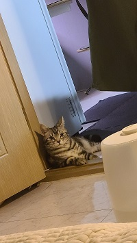

# 한도형

&nbsp; 안녕하세요, 한도형입니다. 

&nbsp; 데이터 분석과 AI에 관심이 많습니다. 

&nbsp; 필요한 데이터를 잘 모아 관리하기 위해 백엔드 지식을 쌓고자 마음 먹고, SSAFY에 지원하게 되었습니다.

**좌우명**:

&ensp;*긍정적으로 생각하기*

&ensp;*하루하루 조금씩 나아지기*

## Profile

**전공** : 산업공학과

**MBTI** : INTP&nbsp;(공감해보기 lv2, 안 세우면 안될 때쯤 계획 세우기 lv2)

**가족** : 쿠키
(아메리칸 숏헤어, 올해로 5살)

**취미** : 
* 게임(LOL 외 잡다한 Steam 게임)
* 유튜브와 각종 OTT 보기 (게임, 요리, 웃음, 예능)
* 방탈출하기 (20방 방린이)
* 음악 듣기 (발라드, 재즈, 약간의 KPOP)
* 가끔 주식 하기
* ~~코테 문제 풀기~~
* ~~운동하기~~

**사는 곳** : 신당역 6호선, 신당동 떡볶이 타운 앞

**특징** : 
* 알레르기 비염 달고 살음
* 밖에 잘 안나옴. 약속 취소되면 좋아함
* 6시 땡하면 버스타야해서 앞만 보고 달림
* 주로 한식(A) 먹음
* 알고리즘 스터디 하고 싶음

## ~~아마도~~ 할 줄 아는 것
Python 조금

데이터 분석 조금

시각화 조금

## 하고 싶은 것
#### Computer vision
#### AI
#### 배운 것들로 돈 많이 버는 서비스 만들기

